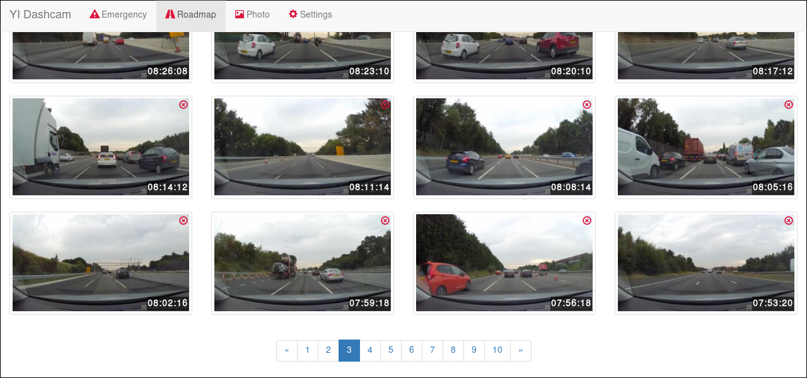
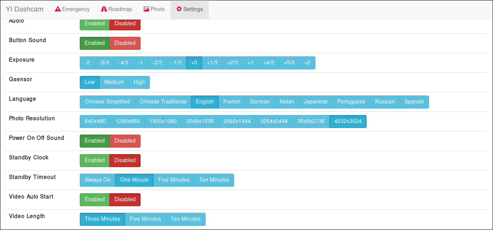

=========================
YI Dashcam python library
=========================
An unofficial python library for interfacing with the Xiaomi YI Dash Cam.

Disclaimer
==========
USE AT YOUR OWN RISK! This is an unofficial software library which may cause
permanent damage to your dash camera and permanent loss of data.

Requirements
============
The main library requires:

* `Python >= 3.4 <http://www.python.org/>`_
* `Requests <http://docs.python-requests.org/en/master/>`_

The web application requires (optional):

* Flask-Bootstrap_

.. _Flask-Bootstrap: https://pythonhosted.org/Flask-Bootstrap/

Installation
============
This library can be installed from PyPI by simply using:

.. code-block:: bash

   python -m pip install yidashcam

Usage
=====
To use any of the below, you must connect to your dash camera via WiFi first.

Web Application
---------------
To use the web application, run: ``python -m yidashcam webapp`` (requires
Flask-Bootstrap_). This hosts a local web app accessible via your web browser,
allowing browsing of the dashcam's stored video and modification of the
dashcam's settings.

    Sample screenshot of file list page

    Sample screenshot of settings page

Command Line
------------
There are three command line based tools:

* ``python -m yidashcam config`` displays the current dashcam settings and
  allows changing of these settings.
* ``python -m yidashcam stream`` puts the dashcam in a mode to allow live
  streaming from the dash camera.
* ``python -m yidashcam snapshot`` takes a photo with the dashcam and saves it
  in current directory or specified file.

Library
-------
An example of using `yidashcam` (sync emergency clips to current folder):

.. code-block:: python

    import os
    import yidashcam

    with yidashcam.YIDashcam() as yi:
        print("Serial number: {}".format(yi.serial_number))
        for emr_file in yi.emergency_list:
            if not os.path.exists(emr_file.name):
                print("Fetching {}...".format(emr_file.path))
                with open(emr_file.name, 'wb') as local_file:
                    for data in yi.get_file(emr_file):
                        local_file.write(data)

Another example (setting a config value, taking a photo and downloading it to
the current folder):

.. code-block:: python

    import yidashcam

    with yidashcam.YIDashcam() as yi:
        yi.set_config(yidashcam.config.Option.photo_resolution,
                      yidashcam.config.PhotoResolution.r1920x1080)
        yi.take_photo()
        photo = sorted(yi.photo_list)[-1]
        with open(photo.name, 'wb') as local_file:
            for data in yi.get_file(photo):
                local_file.write(data)

License
=======
MIT License

Copyright (c) 2016 Steven Hiscocks

Permission is hereby granted, free of charge, to any person obtaining a copy
of this software and associated documentation files (the "Software"), to deal
in the Software without restriction, including without limitation the rights
to use, copy, modify, merge, publish, distribute, sublicense, and/or sell
copies of the Software, and to permit persons to whom the Software is
furnished to do so, subject to the following conditions:

The above copyright notice and this permission notice shall be included in all
copies or substantial portions of the Software.

THE SOFTWARE IS PROVIDED "AS IS", WITHOUT WARRANTY OF ANY KIND, EXPRESS OR
IMPLIED, INCLUDING BUT NOT LIMITED TO THE WARRANTIES OF MERCHANTABILITY,
FITNESS FOR A PARTICULAR PURPOSE AND NONINFRINGEMENT. IN NO EVENT SHALL THE
AUTHORS OR COPYRIGHT HOLDERS BE LIABLE FOR ANY CLAIM, DAMAGES OR OTHER
LIABILITY, WHETHER IN AN ACTION OF CONTRACT, TORT OR OTHERWISE, ARISING FROM,
OUT OF OR IN CONNECTION WITH THE SOFTWARE OR THE USE OR OTHER DEALINGS IN THE
SOFTWARE.
